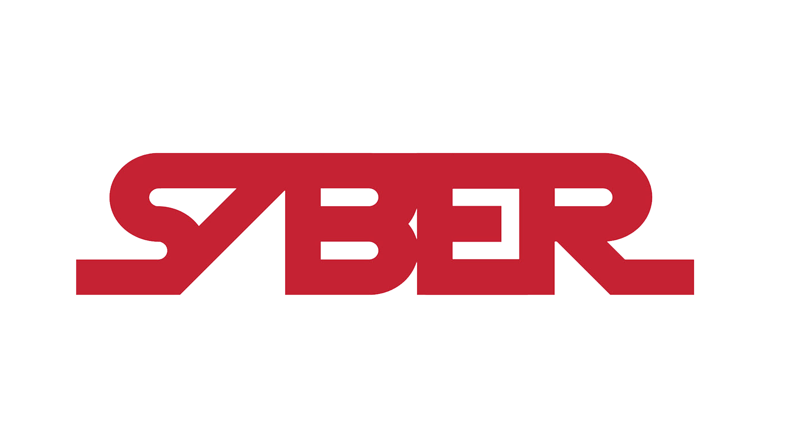

<!-- Sideways ASCII Lightsaber (Top) -->

<!--
    ||||||||||||||||||||||||||||||||||||||||||||||||
-->

  

# Saber | UnknwnSaber

🛡️ Red Team Enthusiast &nbsp; | &nbsp; 🧑‍💻 Python Automation &nbsp; | &nbsp; 🔒 Social Engineer

---

## About Me

Hi, I’m Saber (aka UnknwnSaber)!

I’ve been coding for a while now, with a strong passion for building tools that solve real-world problems. Over time, I’ve developed a solid foundation in cybersecurity—especially in areas like network analysis, automation, and red teaming. My journey so far has included creating advanced port scanners, packet sniffers, and other security-focused utilities.

I’m always eager to learn more and push my skills further. Right now, I’m focused on deepening my expertise in advanced networking, red teaming methodologies, and social engineering tactics. I believe in sharing my progress, documenting my projects, and contributing to the cybersecurity community as I grow.

If you’re interested in collaborating, have feedback, or just want to connect, feel free to reach out!

---

## Featured Projects

- [PortSaber](https://github.com/unknwnsaber/portsaber)  
  Advanced port scanner for real-world recon

- [SaberSniff](https://github.com/unknwnsaber/sabersniff)  
  Powerful packet sniffer for network analysis

---

## Currently Learning

- Advanced networking (Packet Tracer labs)  
- Red teaming methodologies  
- Social engineering tactics

---

## Connect with me

  
  &nbsp;&nbsp;
  

<!-- Sideways ASCII Lightsaber (Bottom) -->

<!--
    ||||||||||||||||||||||||||||||||||||||||||||||||
-->

